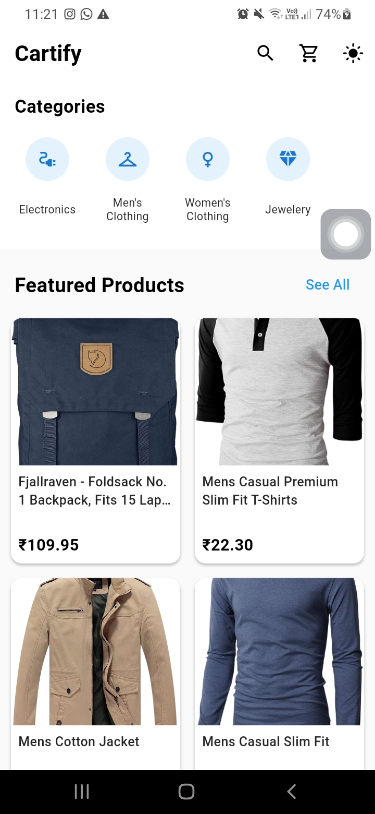
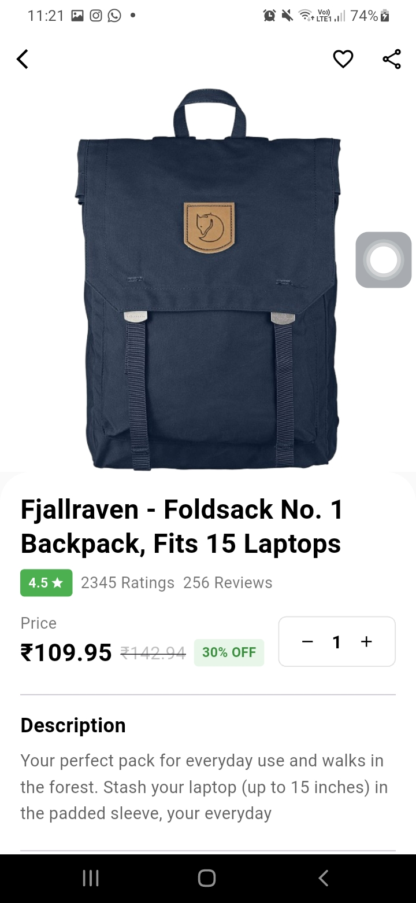
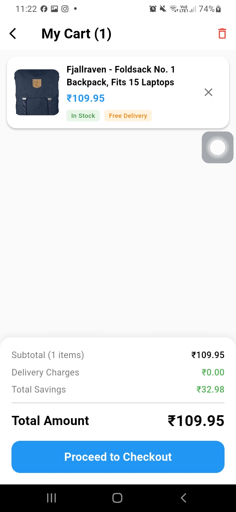

# 🛒 Cartify – E-commerce Product Listing App

Cartify is a Flutter-based e-commerce product listing application built using clean architecture and Riverpod state management. It demonstrates API integration, cart management, and modern UI/UX practices.

---

## 🚀 Features

* 📦 Product Listing (API-based)
* 🔍 Product Detail Page
* 🛒 Add to Cart Functionality
* 🧾 Cart Page with Total Calculation
* 💾 Cart Persistence (SharedPreferences)
* ❤️ Favorite Toggle (Icon state change)
* 📤 Share Product Feature
* 🔎 Search Products
* 🗂️ Category Filtering
* 🌙 Dark Mode Support

---

## 🏗️ Architecture

Feature-first clean architecture:

```
lib/
├── core/
│   ├── constants/
│   ├── theme/
│
├── data/
│   ├── models/
│   ├── services/
│
├── features/
│   ├── products/
│   │   ├── providers/
│   │   ├── screens/
│   │   ├── widgets/
│   │
│   ├── cart/
│   │   ├── providers/
│   │   ├── screens/
│   │   ├── widgets/
│
├── main.dart
```

---

## 🧰 Tech Stack

* Flutter
* Riverpod (State Management)
* HTTP (API Integration)
* SharedPreferences (Local Storage)
* Cached Network Image

---

## 🌐 API Used

https://fakestoreapi.com/products

---

## 📱 Screens

* Product List Screen
* Product Detail Screen
* Cart Screen

---

## 📸 Screenshots

## 📸 Screenshots

| Home Screen | Product Detail | Cart |
|------------|---------------|------|
|  |  |  |

### 🌙 Dark Mode
![Dark]

---

## 🛠️ Setup & Run

```bash
git clone https://github.com/Arshanishad/cartify_app.git
cd cartify
flutter pub get
flutter run
```

---

## 🎯 Key Highlights

* Clean and scalable architecture
* Efficient state management using Riverpod
* Smooth UI/UX with responsive design
* API integration with error handling
* Local cart persistence

---

## 📌 Future Improvements

* Quantity management in cart
* Checkout flow
* Favorites screen
* Backend integration (Node.js)

---

## 👨‍💻 Author

Arsha Mp
Flutter Developer

---
